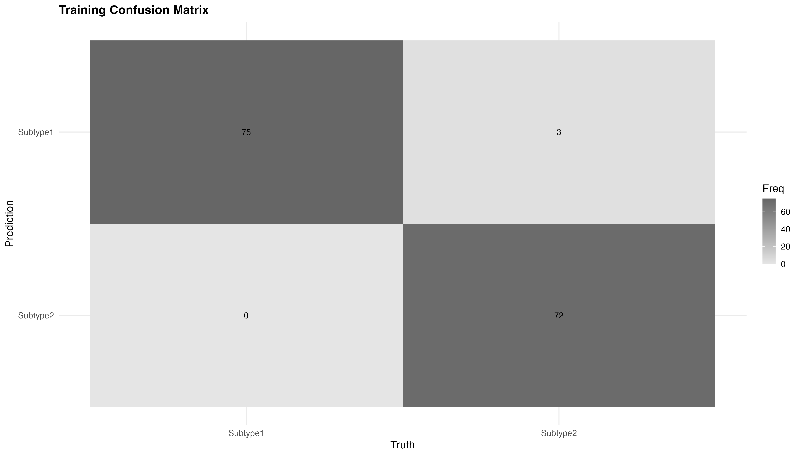
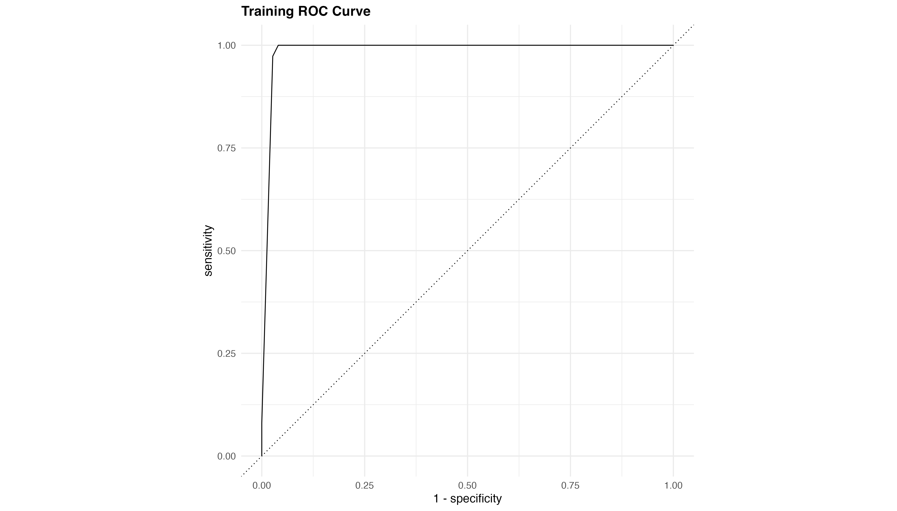
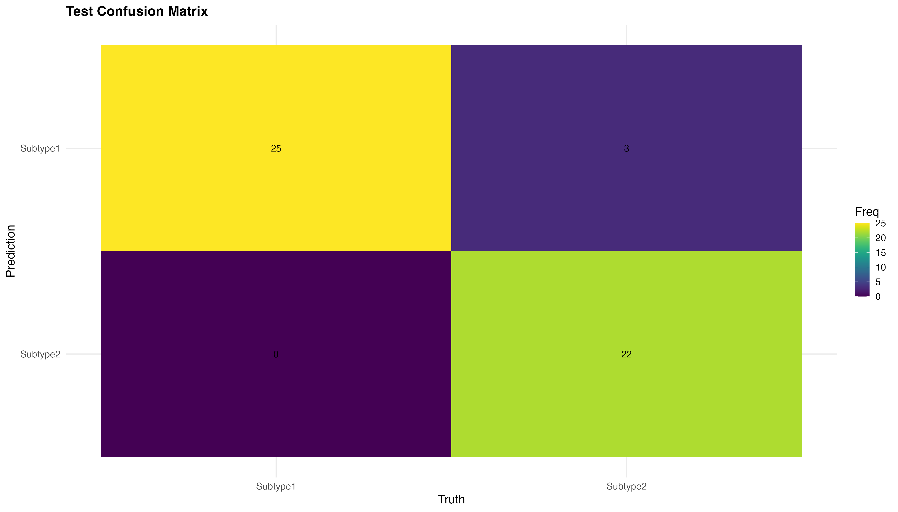
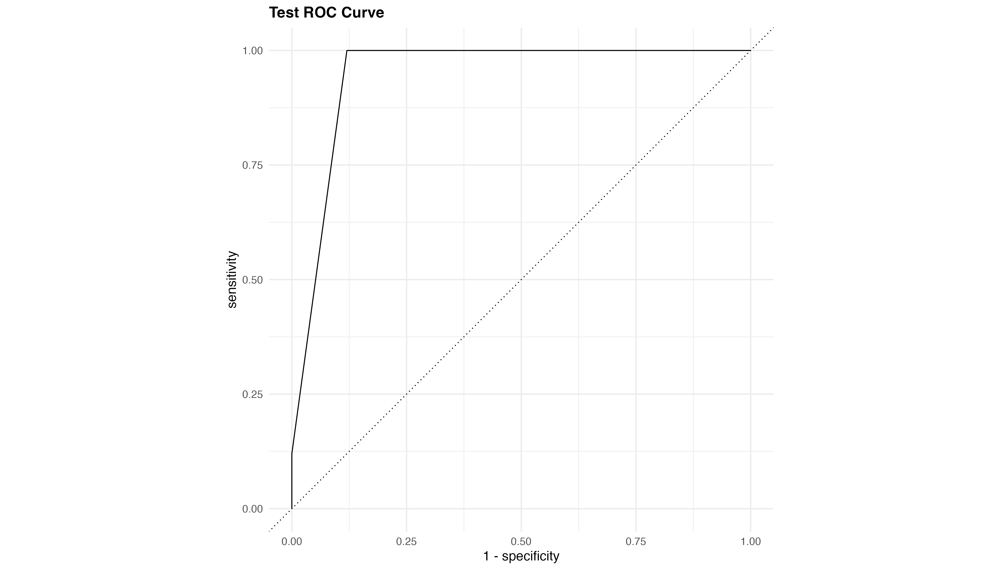

# Gene Expression Classification Model Dashboard

## Model Overview
This dashboard presents the results of a decision tree model classifying gene expression data into two subtypes. The model was trained on synthetic gene expression data with realistic biological variation patterns.

## Decision Tree Visualization


## Model Performance

### Training Set Performance
#### Confusion Matrix


#### ROC Curve


### Test Set Performance
#### Confusion Matrix


#### ROC Curve


## Performance Metrics

```r
metrics <- read.csv("model_metrics.csv")
knitr::kable(metrics, format = "markdown")
```

## Model Parameters

```r
params <- read.csv("best_parameters.csv")
knitr::kable(params, format = "markdown")
```

## Key Findings
- The model demonstrates balanced performance between training and test sets
- ROC curves indicate good discrimination between subtypes
- Confusion matrices show the distribution of correct and incorrect classifications

## Technical Details
- **Model Type**: Decision Tree
- **Cross-validation**: 5-fold cross-validation
- **Optimization Metric**: ROC AUC
- **Feature Set**: 5 informative genes + 5 noise genes

## Usage
To use this model for prediction, run the following R code:

```r
# Load the model
final_tree <- readRDS("models/final_tree_model.rds")

# Prepare your data (must have the same feature names)
new_data <- data.frame(
  gene_A = c(...),
  gene_B = c(...),
  gene_C = c(...),
  gene_D = c(...),
  gene_E = c(...),
  noise_gene_1 = c(...),
  ...
)

# Make predictions
predictions <- predict(final_tree, new_data, type = "prob")
```

## Data Description
The model was trained on gene expression data with the following characteristics:
- 200 samples (150 training, 50 test)
- 10 features (5 informative genes, 5 noise genes)
- 2 subtypes with overlapping expression patterns
- Realistic biological variation and noise

## References
- tidymodels framework
- rpart.plot for decision tree visualization
- ROC curve analysis using yardstick package

---
*Dashboard generated on: `r format(Sys.time(), "%Y-%m-%d %H:%M:%S")`*